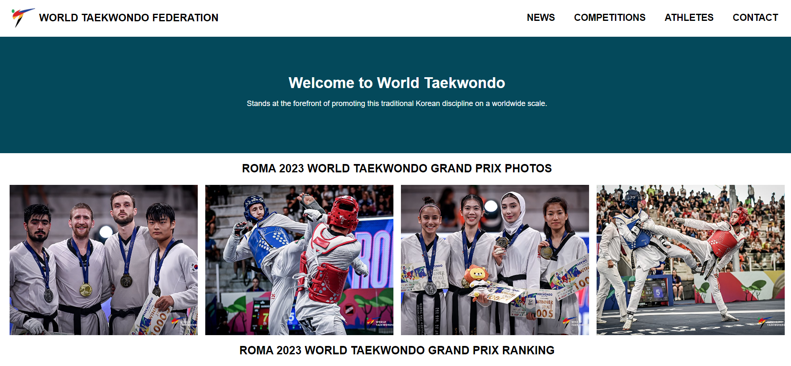

<!--  -->
# Week-2 RevoU Assignment 👨‍💻

## Hi 👋 I'am Alyuza Satrio Prayogo 
Pada tugas kedua ini saya membuat website seputar beladiri Taekwondo.
Website ini dapat ditampilkan pada layar mobile dengan size minimal 380px dan size yang direkomendasikan adalah 1440px.

Di dalam navigation ada beberapa menu:
- Berita
- Kompetisi
- Profil atlit
- Kontak

Menu-menu diatas belum terhubung dengan link.
Untuk Hamburger belum diaplikasikan, kedepannya akan dibuat 'ketika hambuger di klik maka akan keluar menu Berita, Kompetisi, Profil atlit dan Kontak'
## KOMPONEN YANG DIGUNAKAN
- HTML
- CSS
- JavaScript (masih kosong)
- Assets (Picture)

###DEPLOYMENT

Click [here](https://world-taekwondo.netlify.app/) to see MY Project 